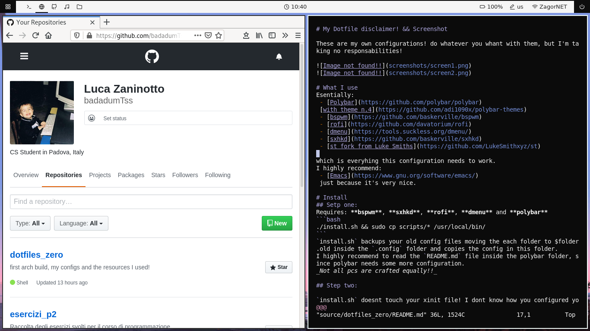
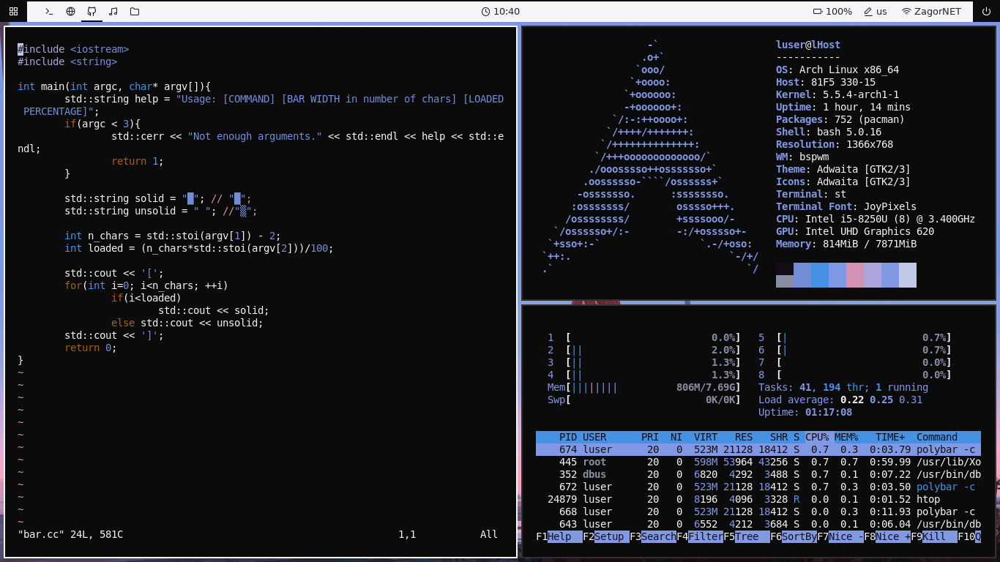
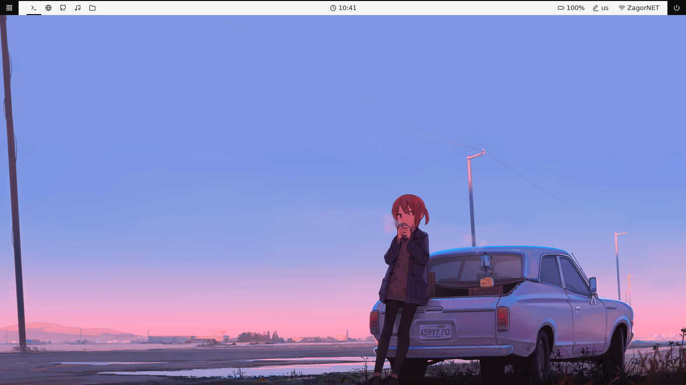

# My Dotfile disclaimer! && Screenshot 

These are my own configurations! do whatever you whant with them, but I'm taking no responsabilities!





I found the background [Here](http://i.4cdn.org/wg/1582038636755.png), on a post in the /wg/ board of 4chan. Though I can't find the OP it seems to appear on various lo-fi videos on yt. in conclusion idk.

# What I use
Esentially:
 - [Polybar](https://github.com/polybar/polybar)
 [with theme n.4](https://github.com/adi1090x/polybar-themes)
 - [bspwm](https://github.com/baskerville/bspwm)
 - [rofi](https://github.com/davatorium/rofi)
 - [dmenu](https://tools.suckless.org/dmenu/)
 - [sxhkd](https://github.com/baskerville/sxhkd)
 - [st fork from Luke Smiths](https://github.com/LukeSmithxyz/st)
 
which is everyhing this configuration needs to work.
I highly recommend:
 - [Emacs](https://www.gnu.org/software/emacs/)
 just because it's very nice.
	
# Install
## Setp one:
Requires: **bspwm**, **sxhkd**, **rofi**, **dmenu** and **polybar**
```bash
./install.sh && sudo cp scripts/* /usr/local/bin/
```
`install.sh` backups your old config files moving the each folder to $folder.old inside the `.config` folder and copies the config in this folder. 
I highly recommend to read the `README.md` file inside the polybar folder, since polybar needs some more configuration. 
_Not all pcs are crafted equally!!_

## Step two:

`install.sh` doesnt touch your xinit file! I dont know how you configured your xserver or wahtever and I dont want to mess up with the graphics (if init fails is a disaster!!).
Take a look at the `xprofile` file to see what I have done with mine and configure yours!
